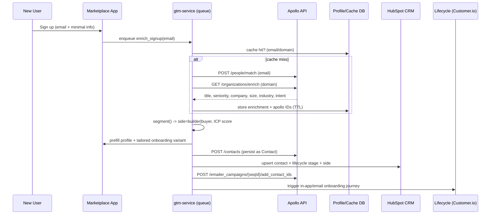
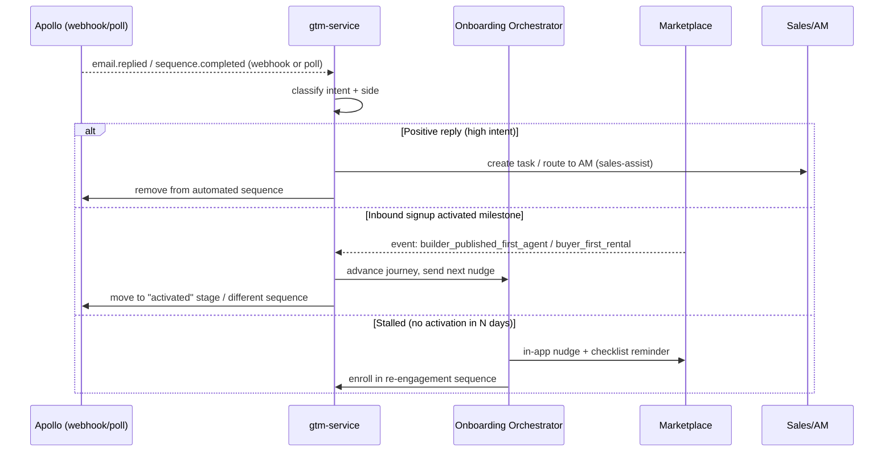

# Apollo.io Integration Research — Outreach & Frictionless Onboarding

> **Project:** Universal AI Agent Marketplace & Rental Platform ("Apify for AI agents")
> **Purpose:** Use Apollo.io to (a) power outbound to acquire **supply** (agent builders) and **demand** (businesses renting agents), and (b) enable automated, low-friction onboarding/activation for new users and leads.
> **Author:** GTM / RevOps Research
> **Last updated:** June 2026
> **Status:** Research → ready for technical/product planning

---

## 0. TL;DR (Executive Summary)

- Apollo.io is an **all-in-one GTM platform**: a **275M+ contact / 73M+ company** B2B database, plus enrichment, multi-channel sequencing, a dialer, basic CRM, intent data, and AI features — bundled at SMB-friendly per-seat pricing ($0–$119/user/mo). [[1]](#s1)[[2]](#s2)[[4]](#s4)
- For our marketplace, Apollo plays **three roles**: (1) **enrichment-on-signup** to auto-fill profiles and segment builders vs. buyers; (2) **list-building** for outbound to both sides of the marketplace; (3) **sequence automation** to nurture inbound signups and outbound prospects.
- The **API is REST/JSON**, authenticated with a **master API key** via the `X-Api-Key` header. Core endpoints: **People Search** (`/mixed_people/api_search`), **People Enrichment** (`/people/match`, `/people/bulk_match`), **Organization Enrichment** (`/organizations/enrich`, `/organizations/bulk_enrich`), **Create Contact** (`/contacts`), **Add Contacts to Sequence** (`/emailer_campaigns/{id}/add_contact_ids`). [[6]](#s6)[[7]](#s7)[[9]](#s9)[[11]](#s11)[[14]](#s14)
- **Critical data-model rule:** Sequences only accept **Contacts** (people explicitly saved to your team's Apollo account), not raw "people". The canonical flow is **Enrich → Create Contact → Add to Sequence**. [[14]](#s14)[[15]](#s15)
- **Rate limits are plan-dependent** (e.g., ~600 calls/hour on `mixed_people/api_search` on standard plans; daily caps from 600 → 6,000+). Design around **batching, queuing, caching, and exponential backoff on 429s**. [[7]](#s7)[[8]](#s8)
- **Webhooks are partial.** Apollo delivers **async enrichment results** (waterfall email/phone) to a `webhook_url` you pass per request, and supports **event webhooks** (e.g., `contact.created`, `email.replied`) configured in **Settings → Integrations** or via Zapier — but it is **not** a fully generic, Stripe-grade webhook system. Plan a **hybrid: event webhooks where available + polling** the sequence/activity endpoints as the reliable fallback. [[10]](#s10)[[12]](#s12)[[13]](#s13)
- **Don't bet deliverability on Apollo alone.** Real-world email accuracy is ~65–90% by segment; for high-volume cold sending, pair Apollo (data + orchestration) with a **dedicated sender (Instantly / Smartlead)** and treat **HubSpot/Customer.io** as system-of-record / lifecycle messaging. [[2]](#s2)[[5]](#s5)[[16]](#s16)[[18]](#s18)
- **Onboarding is two funnels.** Treat supply (builders) and demand (buyers) as separate funnels with separate activation metrics; reach **liquidity** (probability of a successful match), not just signups. Use **progressive profiling + Apollo enrichment** to keep forms short, **PQL-triggered sales-assist** for high-value accounts, and **PLG self-serve** for everyone else. [[19]](#s19)[[20]](#s20)[[21]](#s21)

---

## 1. Apollo.io Capabilities (2026)

### 1.1 What Apollo is

Apollo is a B2B **sales intelligence + sales engagement** platform that consolidates contact discovery, enrichment, and outreach into one interface. It positions itself as an all-in-one alternative to "ZoomInfo + Lemlist + HubSpot." [[1]](#s1)[[2]](#s2)[[3]](#s3)

### 1.2 Database & data

| Attribute | Detail |
|---|---|
| Contacts | **275M+** claimed contacts (older marketing pages say 230M+); ~96M described as "verified" in third-party tests [[1]](#s1)[[2]](#s2)[[5]](#s5) |
| Companies | **73M+** companies (some pages cite 30M) [[2]](#s2)[[1]](#s1) |
| Data sourcing | Public records, user contributions (community-sourced), third-party partnerships [[2]](#s2) |
| Filters | **65+ precision filters** — title, seniority, location, industry, company size, technographics, hiring signals, funding events [[1]](#s1)[[5]](#s5) |
| Coverage strengths | **US-based + technology** companies are strong; enterprise, international, and niche industries are spottier — **validate against your ICP** [[2]](#s2) |
| Email accuracy | Marketed ~98.5% (7-step validation); **independent tests put real-world deliverability at ~65–90%** depending on region/ICP. Secondary verification recommended for critical campaigns [[1]](#s1)[[5]](#s5)[[2]](#s2) |

### 1.3 Feature surface

- **Enrichment**: real-time email/phone + firmographic enrichment; CRM sync to keep job titles, employer changes, tech installs, and funding events fresh. **Waterfall enrichment** checks connected third-party sources for broader coverage. [[1]](#s1)[[9]](#s9)
- **Sequences / outreach automation**: multi-step, multi-channel — **email + phone + LinkedIn + manual tasks** in one workflow, with conditional branches, A/B testing, AI-generated templates, and **send-time optimization** (Apollo claims 2–3× reply-rate improvement). [[3]](#s3)[[4]](#s4)
- **Apollo AI**: AI writing assistant (pulls title/company/industry/recent activity from the DB), AI lead scoring, AI-driven send-time optimization, next-best-action recommendations, and a natural-language search assistant (beta). [[4]](#s4)[[5]](#s5)
- **Dialer**: built-in dialer (Professional+), call recording/transcripts (Organization). [[2]](#s2)
- **Intent data**: buying-intent topics/filters, sourced via LeadSift; firmographic `intent_strength` / `has_intent_signal_account` fields surface on org records. Intent filters unlock on Organization tier. [[2]](#s2)[[11]](#s11)
- **CRM / deal features**: basic CRM (contacts, accounts, deals, contact stages, tasks) — usable as a lightweight CRM or synced to Salesforce/HubSpot. [[2]](#s2)
- **Meetings**: inbound meeting routing/scheduler for booking from sequences. [[13]](#s13)

### 1.4 Pricing (2026, per user, annual billing unless noted)

| Plan | Price | Notable inclusions |
|---|---|---|
| **Free** | **$0** | ~10K email credits/mo, ~5 phone (mobile) credits/mo, basic sequences, LinkedIn extension, Gmail-only campaigns, API access (low rate limits) [[2]](#s2)[[4]](#s4) |
| **Basic** | **$49/user/mo** ($59 monthly) | Unlimited email, ~75 phone credits/mo, advanced filters, intent topics, CRM integrations [[2]](#s2)[[4]](#s4) |
| **Professional** | **$79/user/mo** ($99 monthly) | ~150 phone credits/mo, advanced dialer, A/B testing, AI writing, advanced reports — **the common "sweet spot"** [[2]](#s2)[[4]](#s4) |
| **Organization** | **$119/user/mo** ($149 monthly), **3-seat min** | ~200 phone credits/mo, intent filters, call transcripts, SSO, **advanced API access**, account automation [[2]](#s2)[[4]](#s4) |

**Cost notes:** Annual billing typically gives ~2 months free. **Phone credits are the hidden cost** — heavy calling burns the allotment fast (~$0.10–0.20/credit for top-ups). API access exists on all tiers but **higher rate limits and advanced API features require higher tiers**. [[2]](#s2)[[8]](#s8)

---

## 2. Apollo API & Integrations

### 2.1 Auth & conventions

- **Auth:** master **API key** in the request header.
  - Canonical header (per official docs): `X-Api-Key: <YOUR_KEY>` plus `Content-Type: application/json` and `Cache-Control: no-cache`. [[6]](#s6)
  - Some endpoints also accept `Authorization: Bearer <KEY>` (bearer + apiKey are both listed in the OpenAPI security schemes). Prefer `X-Api-Key` for consistency. [[9]](#s9)[[15]](#s15)
- **Master key required** for search/enrichment endpoints; a non-master key returns **403**. Create keys in **Settings → Integrations → API Keys** and scope to the endpoints you need. [[7]](#s7)[[8]](#s8)
- **Base URL:** `https://api.apollo.io/api/v1/...`

### 2.2 Key endpoints

| Use case | Method + Endpoint | Notes |
|---|---|---|
| **People Search** (find net-new people) | `POST /api/v1/mixed_people/api_search` | Filters: `person_titles`, `person_locations`, `organization_locations`, `person_seniorities`, `organization_num_employees_ranges`, etc. **Does NOT return emails/phones** and **does not consume credits**. Pagination `per_page` (1–100); **display cap 50,000 records** (100/page × 500 pages). [[6]](#s6)[[7]](#s7) |
| **People Enrichment (single)** | `POST /api/v1/people/match` | Match by email, name+domain, LinkedIn URL, etc. Use `reveal_personal_emails=true` and `reveal_phone_number=true` to return contact info (consumes credits). `reveal_phone_number=true` **requires** a `webhook_url` (phones delivered async). [[9]](#s9) |
| **People Enrichment (bulk)** | `POST /api/v1/people/bulk_match` | Up to **10 people/call** via `details[]`. Same reveal flags; rate-limited to **50% of single-match per-minute** rate. [[10]](#s10) |
| **Organization Enrichment (single)** | `GET /api/v1/organizations/enrich` | Requires `domain`. Returns industry/sub-industry, revenue est., employee count **by department**, location, funding, headcount growth %, and intent fields (`intent_strength`, `has_intent_signal_account`). [[11]](#s11) |
| **Organization Enrichment (bulk)** | `POST /api/v1/organizations/bulk_enrich` | Up to **10 companies/call** via `domains[]` or `details[]` (match by domain/LinkedIn/name/website). [[11]](#s11) |
| **Create Contact** | `POST /api/v1/contacts` | Converts an enriched person into a **Contact** (permanently saved; avoids re-spending credits). Params: `first_name`, `last_name`, `organization_name`, `email`, `website_url`, `direct_phone`, `mobile_phone`, custom fields. [[15]](#s15) |
| **Add Contacts to Sequence** | `POST /api/v1/emailer_campaigns/{sequence_id}/add_contact_ids` | Enrolls **existing contacts** into a sequence. Requires `emailer_campaign_id` (= `sequence_id`) and `send_email_from_email_account_id`; pass either `contact_ids[]` or `label_names[]` (else **422**). [[14]](#s14) |
| **Search Sequences** | `POST /api/v1/emailer_campaigns/search` | Returns sequence metadata + aggregate metrics (`unique_scheduled/delivered/opened/replied/bounced/unsubscribed`). Useful for polling engagement. [[12]](#s12) |
| **Contact Stages / Tasks** | `GET` list contact stages; tasks API | Drive CRM-stage automation and task creation. [[12]](#s12) |
| **Usage stats** | `POST /api/v1/usage_stats/api_usage_stats` | Check remaining rate-limit budget; also exposed via response headers. [[7]](#s7) |

### 2.3 Rate limits (per token, plan-dependent)

| Limit | Free/Trial | Basic | Professional | Organization |
|---|---|---|---|---|
| Calls / minute | 50 | 200 | 200 | 200 / Custom |
| Calls / hour | 200 | 400 | 400 | 600 / Custom |
| Calls / day | 600 | 2,000 | 2,000 | 6,000 / Custom |

Notes: limits are **per endpoint** in some cases (docs show `mixed_people/api_search` and `organizations/enrich` capped at **600/hour** on standard plans). **Bulk endpoints** are throttled to **50% of the single-record per-minute** rate but share the hourly/daily caps. Always honor **429** with exponential backoff. [[8]](#s8)[[7]](#s7)[[11]](#s11)

**Status-code handling:** `200 + "no records enriched"` → inputs too vague, don't retry; `401/403` → bad/missing master key, don't retry; `400/422` → bad payload, fix and resend; `429` → back off and retry; `5xx` → retry with exponential backoff. [[8]](#s8)

### 2.4 Webhooks — the honest picture

Apollo's webhook story is **two-part and incomplete vs. Stripe**:

1. **Async enrichment delivery (per-request `webhook_url`)** — official and reliable. When you call People Enrichment with `reveal_phone_number=true` or `run_waterfall_email/phone=true`, Apollo returns synchronous firmographic data immediately and then **POSTs the revealed email/phone to your `webhook_url`** minutes later. Your endpoint must be **HTTPS, idempotent, and rate-tolerant** (Apollo may retry). [[9]](#s9)[[10]](#s10)
2. **Event webhooks** — configurable in **Settings → Integrations → Webhooks** (and via Zapier "Webhooks by Zapier"). Commonly cited events: `contact.created`, `contact.updated`, `contact_stage.changed`, `sequence.started`, `sequence.completed`, `email.sent`, `email.opened`, `email.clicked`, `email.replied`, `email.bounced`. Availability of richer events can depend on plan tier. [[12]](#s12)[[13]](#s13)

> ⚠️ **Caveat:** Several integration write-ups note Apollo lacks a fully generic native webhook system and recommend **polling** the search/sequence/activity endpoints for guaranteed coverage. **Design for hybrid:** subscribe to event webhooks where available, but run a **scheduled poller** (e.g., every 5–15 min) on `emailer_campaigns/search` and contacts search as the source of truth. [[13]](#s13)[[12]](#s12)

### 2.5 Programmatic patterns we'll rely on

- **Enrich a signup:** `people/match` (by email) + `organizations/enrich` (by email domain) → map to profile fields.
- **Persist without re-spending credits:** `contacts` (Create Contact) after enrichment. [[15]](#s15)
- **Auto-enroll into outreach:** `emailer_campaigns/{id}/add_contact_ids` with the new contact ID + the correct sending mailbox. [[14]](#s14)
- **Build target lists for outbound:** `mixed_people/api_search` with ICP filters (free, no credits) → enrich only the rows you'll actually contact. [[6]](#s6)
- **Close the loop:** poll `emailer_campaigns/search` for reply/bounce/open metrics; on `email.replied` → stop sequence + create a sales task / CRM stage change. [[12]](#s12)

---

## 3. Integration Architecture for the AI Agent Marketplace

### 3.1 Design principles

1. **Apollo is an integration target behind our own service layer** — never call it directly from the client. Wrap it in an internal **`gtm-service`** (queue-backed) so we control rate limits, caching, credit spend, and PII handling.
2. **Credits are money.** Cache every enrichment result in our DB; convert enriched people to **Contacts** so we don't re-pay. Never enrich the same record twice without a TTL check. [[15]](#s15)
3. **Two funnels, one pipeline.** Every person is tagged `side = builder | buyer` early, because it determines segmentation, sequence selection, and activation metrics.
4. **PLG-first, sales-assist on signal.** Self-serve onboarding is the default; outbound/sales-assist is layered on for high-fit/high-intent accounts (PQLs).
5. **Deliverability is sacred.** Route high-volume cold outbound through a dedicated sender; keep transactional/lifecycle email in a lifecycle tool (see §5).

### 3.2 System components

```
                ┌──────────────────────────────────────────────────────────┐
                │                  Marketplace Platform                      │
                │                                                            │
   Signup ──▶   │  Web/App ──▶ API Gateway ──▶ User/Account Service ──┐      │
   form         │                                                     │      │
                │                                          ┌──────────▼────┐ │
                │                                          │  gtm-service  │ │
   Inbound      │                                          │ (queue + jobs)│ │
   webhook ─────┼────────────────────────────────────────▶│  - enrich     │ │
   (Apollo)     │                                          │  - segment    │ │
                │                                          │  - enroll     │ │
                │                                          │  - poll/sync  │ │
                │                                          └───┬───────┬───┘ │
                │   Event Bus (e.g. SQS/Kafka) ◀───────────────┘       │     │
                │        │                                             │     │
                │        ▼                                             ▼     │
                │  Onboarding Orchestrator        Data Store (profiles,      │
                │  (in-product checklists,        enrichment cache,          │
                │   nudges, lifecycle)            Apollo contact IDs)        │
                └────────┼─────────────────────────────┼────────────────────┘
                         │                              │
                         ▼                              ▼
              Lifecycle email (Customer.io)     Apollo.io  ◀──▶ Dedicated sender
              + in-app guides                   (data, enrich,   (Instantly/Smartlead)
                                                 sequences)        for cold volume
                                                       │
                                                       ▼
                                                 CRM (HubSpot) = source of truth
```

### 3.3 Flow A — Enrich & segment on signup (inbound)

**Goal:** keep the signup form to email + password; auto-fill everything else and classify builder vs. buyer.



**Segmentation heuristics (builder vs. buyer):**
- **Builder (supply) signals:** title contains engineer/developer/founder/ML/AI/automation; works at a dev agency or small software company; technographics show dev tooling; self-selected "I want to publish agents."
- **Buyer (demand) signals:** ops/marketing/sales/RevOps/CX titles; SMB–enterprise headcount; industry with high automation appetite; self-selected "I want to use/rent agents."
- Use Apollo `title`, `seniority`, `organization.industry`, `employee_count_by_department`, and `intent_strength` to score; store a confidence value and let users correct (feeds back into the model). [[11]](#s11)[[9]](#s9)

### 3.4 Flow B — Outbound list-building & enrollment (both sides)

```mermaid
flowchart TD
    A[Define ICP segment] --> B{Side?}
    B -->|Supply: agent builders| C[Apollo People Search:\nperson_titles = dev/AI/automation,\nagencies, small software cos]
    B -->|Demand: businesses| D[Apollo People Search:\nops/marketing/RevOps titles,\nSMB-Enterprise, high-intent industries]
    C --> E[mixed_people/api_search\n(no credits, ICP filters)]
    D --> E
    E --> F[Score + dedupe vs existing users/CRM]
    F --> G[Enrich only selected rows\npeople/bulk_match + reveal flags]
    G --> H[Verify emails\n(secondary verifier)]
    H --> I[Create Contacts\nPOST /contacts]
    I --> J[Add to tailored sequence\nemailer_campaigns/{id}/add_contact_ids]
    J --> K{Volume?}
    K -->|Low/medium| L[Apollo native sequencer]
    K -->|High cold volume| M[Hand off to Instantly/Smartlead\nfor deliverability]
    L --> N[Poll emailer_campaigns/search\nreply/bounce/open]
    M --> N
    N --> O[On reply -> stop seq,\ncreate sales task, CRM stage change]
```

**Target-list examples:**
- **Supply (agent builders):** AI/automation agencies, indie devs, ML engineers, "AI consultancy" companies, dev-tool power users. Filters: `person_titles` (AI engineer, automation consultant, founder), small `organization_num_employees_ranges`, technographics for dev/AI tooling. [[6]](#s6)
- **Demand (businesses needing automation):** SMB/mid-market ops, support, marketing, sales teams; industries with repetitive workflows (agencies, e-commerce, SaaS, professional services); filter on **intent topics** like "marketing automation," "AI tools," "RPA." [[6]](#s6)[[2]](#s2)

### 3.5 Flow C — Event-driven onboarding triggers



**Trigger sources we'll wire:**
- **From Apollo → us:** `contact.created`, `email.replied`, `email.bounced`, `sequence.completed` (event webhook where available; polling `emailer_campaigns/search` as fallback). [[12]](#s12)[[13]](#s13)
- **From us → Apollo:** product events (signup, profile completed, first agent published, first rental, usage thresholds) drive **stage changes** and **sequence enrollment/removal** via the API.

### 3.6 PII, compliance & ops guardrails

- **HTTPS + idempotent** webhook handlers; verify a shared `secret`; dedupe on Apollo IDs (retries are expected). [[9]](#s9)[[10]](#s10)
- **Mask/limit PII** in logs; store revealed emails/phones encrypted; honor unsubscribe/`email.bounced` immediately to protect domain reputation. [[8]](#s8)
- **Credit governance:** central budget per day; only `reveal_*` on rows you will actually contact; cache + Create Contact to avoid re-spend. [[15]](#s15)
- **Suppression list:** never enrich/enroll existing users, opt-outs, or competitors; dedupe against CRM before enrollment.
- **Compliance:** GDPR/CAN-SPAM/CASL — lawful basis for cold outreach varies by region; keep opt-out, sender identity, and data-retention policies explicit (Apollo data is community-sourced).

---

## 4. Onboarding Best Practices for Two-Sided Marketplaces

### 4.1 First principle: optimize for **liquidity**, not signups

Liquidity = the probability that a buyer finds a usable agent when they show up. A marketplace is really **three businesses**: supply, demand, and the matching engine. Demand brought in before supply is dense enough = wasted CAC and churn. **Seed supply first, then bring demand into categories where supply is concentrated.** [[19]](#s19)[[21]](#s21)

### 4.2 Two distinct funnels

**Supply funnel (agent builders):** Visitor → Sign up → Onboarding (profile, verification) → **Activation = publishes first agent** → first rental/payout.
**Demand funnel (businesses):** Visitor → Search → View agent → Initiate rental → **Activation = first rental** → repeat usage.

Build **two dashboards**; high drop-off pinpoints the fix:
- Supply onboarding drop-off → form too long / KYC broken.
- Supply activation drop-off → publishing tool too complex.
- Demand search→view drop-off → poor relevance/thumbnails (cold-start ranking).
- Demand initiate→transact drop-off → checkout friction / trust gap. [[20]](#s20)

### 4.3 Activation metrics to instrument

| Metric | Side | Why it matters |
|---|---|---|
| Application → first-publish conversion | Supply | Core supply activation [[19]](#s19) |
| **Supply onboarding time** (signup → first discoverable agent) | Supply | Mostly engineering (verification, listing-quality checks). DoorDash cut merchant onboarding 14d→4d for **+31% first-90-day GMV** [[22]](#s22) |
| Listing → first-transaction (median + P90) | Supply | Catches cold-start/ranking drift before CTR dashboards do [[22]](#s22) |
| Visitor → purchase / search → fill | Demand | Demand activation + relevance [[19]](#s19)[[20]](#s20) |
| Inventory density (results per search; keep > 3) | Matching | < 3 results feels empty; drives demand churn [[20]](#s20) |
| Matching latency (query → ranked results) | Matching | UX + conversion [[22]](#s22) |
| Repeat purchase / utilization / sell-through | Both | Retention & marketplace health [[20]](#s20) |

### 4.4 Friction-reduction playbook

**Reduce seller (builder) friction to first published agent:**
- Quality gates + identity/business verification to protect buyer trust — but make them **fast and parallelizable** (fast and compliant are in tension; engineer the verification path). [[19]](#s19)[[21]](#s21)
- Guided publishing wizard, templates/SDK starter, pricing guidance, sandbox test of the agent, analytics dashboard. [[19]](#s19)
- Set expectations ("first buyer may take time; here's what to do meanwhile"). [[20]](#s20)
- Flexible payout schedules → ~20% higher seller retention. [[19]](#s19)

**Reduce buyer friction to first rental:**
- Progressive profiling (collect only what's needed, when needed); **Apollo enrichment auto-fills the rest.** [[20]](#s20)
- Strong search relevance + good thumbnails/descriptions; recommended/curated agents to beat cold start. [[20]](#s20)
- Frictionless, transparent checkout (no hidden fees), free trial / first-rental incentive, "run a demo agent in 60 seconds." [[20]](#s20)
- Contextual walkthroughs, checklists, progress indicators, behavior-triggered nudges. [[20]](#s20)

### 4.5 PLG + sales-assist hybrid

- **Self-serve (PLG)** by default for both sides — frictionless, instant value.
- **Sales-assist on signal:** use **PQLs** — trigger human outreach only when an account hits usage limits or shows high intent (not blanket cold outreach to signups). White-glove the high-value accounts; keep self-serve buyers untouched. [[20]](#s20)[[18]](#s18)
- Apollo's role here: **enrich to compute ICP/PQL fit**, **auto-enroll** the right tier into the right sequence, and **route positive replies to AMs**.

### 4.6 How Apollo plugs into onboarding

- **On signup:** enrich → prefill profile → segment side → pick onboarding variant (less typing = higher activation). [[9]](#s9)[[11]](#s11)
- **Tailored sequences:** builders get an enablement track (publish your first agent, SDK tips, payout setup); buyers get an activation track (find agents, run first rental). Enroll via `add_contact_ids`. [[14]](#s14)
- **Re-engagement:** stalled users (no activation in N days) → re-engagement sequence; activated users → graduated/expansion sequence.
- **Closed loop:** reply/booking events → stop automation, hand to sales-assist.

---

## 5. Alternatives & Complements (Apollo is primary)

| Tool | Primary role | Use it when… | Relationship to Apollo |
|---|---|---|---|
| **Apollo.io** | All-in-one DB + enrichment + sequencing | Lean team needs data + outreach in one bill; SMB/mid-market default | **Primary** — DB, enrichment, sequencing, intent [[2]](#s2)[[16]](#s16)[[17]](#s17) |
| **Clay** | Programmable enrichment/orchestration (waterfall across 100+ sources, AI research per row) | Reply rates stalled, signal-driven outbound, multiple enrichment vendors, agency/RevOps GTM-engineering | **Complement** — Apollo becomes one source inside Clay's waterfall; no sending layer [[16]](#s16)[[18]](#s18)[[25]](#s25) |
| **Instantly** | Cold-email sending infra + warmup + deliverability | Serious about deliverability; sending at volume on secondary domains | **Complement** — sender underneath Apollo/Clay; no DB/enrichment [[16]](#s16)[[17]](#s17) |
| **Smartlead** | High-volume cold-email infra (10K+/mo), warmup, reply tracking | Even higher volume / multi-inbox rotation | **Complement** — sender layer; pair with Apollo/Clay data [[17]](#s17)[[24]](#s24) |
| **HubSpot** | CRM / system of record + lifecycle | Need governance, deal management, reporting, single source of truth | **Complement** — CRM downstream; Clay/Apollo enrich before writing to it [[16]](#s16) |
| **Customer.io** | Lifecycle / behavioral messaging (in-app + email) to **existing users** | Onboarding journeys, activation nudges, product-event-driven messaging | **Complement** — owns **post-signup lifecycle**; Apollo owns acquisition/cold outreach |

**Recommended stack for us (phased):**
- **Phase 1 (lean):** Apollo (data + enrichment + sequences) + Customer.io (onboarding/lifecycle) + lightweight CRM (HubSpot free/starter). Add a secondary email verifier for cold lists.
- **Phase 2 (deliverability):** add **Instantly or Smartlead** as the dedicated cold sender; Apollo stays as data/enrichment + intent + sequencing for warm/low-volume. [[16]](#s16)[[17]](#s17)
- **Phase 3 (GTM engineering):** add **Clay** for signal-driven, AI-personalized waterfall enrichment when manual research becomes the bottleneck; Apollo becomes one source in the waterfall. [[18]](#s18)[[25]](#s25)

> Rule of thumb: **standardize on a 2-platform primary stack** (one data+sequencer, one deliverability specialist) and add Clay only when ops capacity exists. Stack sprawl beyond ~3 platforms rarely pays back. [[17]](#s17)

---

## 6. Recommended Implementation Plan (sequenced)

1. **Provision Apollo Organization tier** (advanced API + intent) once outbound volume justifies; start Professional for the API + sequencing sweet spot. [[2]](#s2)
2. **Build `gtm-service`** (queue-backed) wrapping Apollo with: enrichment cache, credit budgeter, ret/backoff on 429, idempotent webhook receiver, and a poller for `emailer_campaigns/search`. [[7]](#s7)[[8]](#s8)[[12]](#s12)
3. **Wire signup enrichment** (`people/match` + `organizations/enrich`) → profile prefill + builder/buyer segmentation → Create Contact → enroll in onboarding sequence. [[9]](#s9)[[11]](#s11)[[14]](#s14)[[15]](#s15)
4. **Stand up two onboarding tracks** (supply enablement / demand activation) in Apollo + Customer.io; instrument the two activation funnels.
5. **Build outbound list-building jobs** for both sides via `mixed_people/api_search` (credit-free) → selective bulk enrich → verify → enroll. [[6]](#s6)[[10]](#s10)
6. **Add deliverability layer (Instantly/Smartlead)** before scaling cold volume. [[16]](#s16)[[17]](#s17)
7. **Close the loop:** reply/bounce events → sales-assist routing + suppression; PQL signals → sales-assist enrollment. [[12]](#s12)[[18]](#s18)
8. **Layer Clay** when personalization/signal orchestration becomes the bottleneck. [[18]](#s18)

---

## 7. Open Questions / Risks

- **Data accuracy vs. cold-send risk:** ~65–90% email accuracy means we **must** secondary-verify before high-volume cold sends or we'll burn domains. [[5]](#s5)[[16]](#s16)
- **Webhook reliability:** event-webhook coverage may be plan-gated and is not Stripe-grade — **build polling** as the source of truth. [[13]](#s13)[[12]](#s12)
- **Rate limits at scale:** 600/hr on key endpoints (standard plans) will bottleneck large enrichment jobs — batch + queue + custom Org limits. [[7]](#s7)[[8]](#s8)
- **Credit economics:** phone reveals + bulk enrichment can get expensive; enforce budgets and caching. [[2]](#s2)[[15]](#s15)
- **Compliance:** community-sourced data + cold outreach → confirm GDPR/CAN-SPAM/CASL posture per region.

---

## 8. Sources

<a id="s1"></a>[1] Apollo.io — B2B Contact Database / Search product page. https://www.apollo.io/product/search
<a id="s2"></a>[2] The RevOps Report — *Apollo.io Review 2026 (RevOps Perspective)* — pricing tiers, 275M/73M, credits, phone-credit costs. https://therevopsreport.com/tools/apollo/
<a id="s3"></a>[3] Hack'celeration — *Apollo.io Review 2026: Pros and Cons Tested*. https://hackceleration.com/labs/review/apolloio
<a id="s4"></a>[4] TechnologyInSales — *Apollo.io Review 2026: Pricing, Features & Verdict*. https://www.technologyinsales.com/tools/apollo-io
<a id="s5"></a>[5] Amplemarket — *Apollo.io features reviewed (2026)* — accuracy/bounce comparison. https://www.amplemarket.com/blog/what-does-apollo-really-do
<a id="s6"></a>[6] Apollo Docs — *Find People Using Filters* (People API Search usage, headers, params). https://docs.apollo.io/docs/find-people-using-filters
<a id="s7"></a>[7] Apollo Docs — *People API Search* (reference; master key, 50k display limit, 429 example). https://docs.apollo.io/reference/people-api-search
<a id="s8"></a>[8] Generect — *The Apollo Enrichment API in 2026* — rate-limit table, status-code handling, master-key 403. https://generect.com/blog/apollo-enrichment-api/
<a id="s9"></a>[9] Apollo Docs — *People Enrichment* (`/people/match`, reveal flags, webhook_url). https://docs.apollo.io/reference/people-enrichment
<a id="s10"></a>[10] Apollo Docs — *Bulk People Enrichment* (`/people/bulk_match`, 10/call, 50% rate). https://docs.apollo.io/reference/bulk-people-enrichment
<a id="s11"></a>[11] Apollo Docs — *Organization Enrichment* (`/organizations/enrich`, fields incl. intent_strength). https://docs.apollo.io/reference/organization-enrichment ; Bulk: https://docs.apollo.io/reference/bulk-organization-enrichment
<a id="s12"></a>[12] apollo-webhooks-events skill — polling pattern, `emailer_campaigns/search` metrics, event list. https://tonsofskills.com/skills/apollo-webhooks-events/ ; https://eliteai.tools/agent-skills/apollo-webhooks-events-1
<a id="s13"></a>[13] Apollo→Brevo via n8n (2026) — Settings→Integrations→Webhooks events (`contact.created`, `contact_stage.changed`), polling vs webhook. https://whoisalfaz.me/blog/apollo-brevo-n8n-outbound-pipeline/ ; Zapier: https://zapier.com/apps/apollo/integrations/webhook
<a id="s14"></a>[14] Apollo Docs — *Add Contacts to a Sequence* (`/emailer_campaigns/{id}/add_contact_ids`, required params). https://docs.apollo.io/reference/add-contacts-to-sequence
<a id="s15"></a>[15] Apollo Docs — *Convert Enriched People to Contacts* (`POST /contacts`, credit avoidance). https://docs.apollo.io/docs/convert-enriched-people-to-contacts
<a id="s16"></a>[16] DevCommX — *Clay vs Apollo vs Instantly (2026)* — roles, accuracy, dialer/multichannel/API matrix. https://www.devcommx.com/blogs/clay-vs-apollo-vs-instantly-comparison
<a id="s17"></a>[17] DigitalApplied — *AI SDR Platforms 2026: Apollo, Outreach, Clay, Lemlist* — segment fit, stack pattern. https://www.digitalapplied.com/blog/ai-sdr-platforms-apollo-outreach-clay-lemlist-2026
<a id="s18"></a>[18] Perkins Growth — *Clay vs Apollo for B2B Outbound* — when to add Clay, Apollo as a source in waterfall. https://perkinsgrowth.com/blog/clay-vs-apollo
<a id="s19"></a>[19] AdoptKit — *Onboarding for Marketplaces: Two-Sided Platform Challenges* — two funnels, quality gates, payout retention. https://www.adoptkit.com/posts/onboarding-marketplaces-two-sided-platforms
<a id="s20"></a>[20] twosided.io — *Complete Guide to Marketplace Analytics (2025)* — supply/demand funnels, inventory density, conversion. https://twosided.io/blog/complete-guide-to-marketplace-analytics ; UserGuiding — *User Onboarding for Marketplaces* (progressive profiling, two-sided activation). https://userguiding.com/blog/user-onboarding-for-marketplaces
<a id="s21"></a>[21] The Marketplace Guide / Stripe — *Two-Sided Marketplace Playbook: Sequencing, Liquidity*. https://themarketplaceguide.com/articles/the-two-sided-marketplace-playbook-sequencing-liquidity-and-what-actually-breaks-at-scale/
<a id="s22"></a>[22] PanDev — *Marketplace Engineering: Metrics for Two-Sided Products* — supply onboarding time, DoorDash 14d→4d / +31% GMV, matching latency. https://pandev-metrics.com/docs/blog/marketplace-engineering-metrics
<a id="s24"></a>[24] (See [17]) Smartlead positioning for 10K+/mo senders.
<a id="s25"></a>[25] Knowlee — *Clay vs Apollo (2026)* — scope comparison, Clay orchestrates Apollo, no engagement layer. https://www.knowlee.ai/compare/clay-vs-apollo

---

*Notes on confidence:* Figures like "275M contacts / 73M companies" and pricing are vendor- and reviewer-reported (June 2026) and shift over time; older Apollo pages still cite 230M/30M. Email-accuracy ranges are from independent reviewers, not Apollo. Webhook-event availability and exact rate limits can be **plan-gated** — confirm against your contracted Apollo plan and the live API reference before building.
