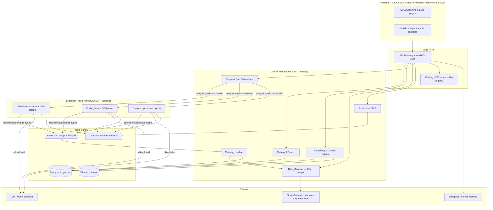

# Technical Architecture Research — Deep Dive
## The Dude — Universal AI Agent Marketplace & Rental Platform ("Apify for AI agents")

> **Version:** 1.0 · **Date:** June 2026 · **Status:** For review · **Author:** Principal architect (research)
> **Purpose:** Extended vendor comparisons + rationale behind the decisions summarized in `../04-technical/architecture.md`. This is the *research* document — it complements (does not duplicate) the architecture summary. All claims are validated against current (June 2026) primary/secondary sources cited inline and in §10.
> **Read first:** `../04-technical/architecture.md` (decisions), `../02-product/prd.md` (requirements), `apify-deep-dive.md` (incumbent).

---

## 0. Executive recommendations (TL;DR)

| # | Area | Recommendation | Confidence |
|---|---|---|---|
| 1 | Untrusted execution (default) | **E2B (Firecracker microVMs)** managed; evaluate self-hosted Firecracker / Fly Sprites at scale | High |
| 2 | GPU / heavy-inference plane | **Modal (gVisor + direct GPU)** as a second, complementary plane | High |
| 3 | Persistent agent workspaces | **Daytona** (sub-90 ms, snapshot/fork, AGPL self-host) for long-lived/dev-style agents | Medium |
| 4 | Interop | **MCP-native + A2A v1.0-ready** (signed Agent Cards); framework-agnostic manifest | High |
| 5 | Orchestration | **Temporal** (durable substrate) wrapping in-VM framework graphs (e.g. LangGraph) | High |
| 6 | Metering + billing | **Self-owned metering → Orb** (PSP-independent, pricing simulation); Stripe-native floor at MVP | High |
| 7 | Marketplace payouts | **Stripe Connect** (destination charges) | High |
| 8 | Merchant-of-Record | **Stripe Managed Payments** (now GA for all digital businesses) — avoids a 2nd vendor | High |
| 9 | Primary DB + memory | **Postgres + pgvector** (single data plane); Qdrant only when tail-latency/hybrid demands it | High |
| 10 | B2B auth | **WorkOS** (per-connection SSO/SCIM) + AuthKit for the PLG base | High |
| 11 | Observability | **OpenTelemetry GenAI semantic conventions** (`invoke_agent`/`execute_tool` span trees) | High |
| 12 | Cloud | **AWS primary** (Firecracker/Nitro lineage, Connect/MoR fit); GCP only if anchoring on Modal/Vertex | Medium |
| 13 | Frontend | **Next.js 16 + Tailwind v4 + shadcn/ui + TanStack Query/Table + RHF/Zod** — 2026 consensus, validated | High |

---

## 1. Sandboxed Agent Execution (the hardest problem)

### 1.1 Why this is different from Apify

Apify runs Actors as **Docker containers on K8s-like infrastructure** (`apify-deep-dive.md` §3) — adequate because Actors are *its own and community scraping code* with a narrower threat profile. The Dude must run **arbitrary, third-party, potentially adversarial agent code** submitted by anonymous builders to a public marketplace. Plain containers share the host kernel; a single container-escape (a recurring CVE class) compromises every co-tenant. The market-research fraud signals (rising malicious-bot activity) raise the stakes further. **The correct baseline is hardware-level isolation (microVMs), not namespaces/cgroups.** ([Northflank — untrusted code](https://northflank.com/blog/best-platforms-for-untrusted-code-execution); [SoftwareSeni — isolation tech for AI agents](https://www.softwareseni.com/firecracker-gvisor-containers-and-webassembly-comparing-isolation-technologies-for-ai-agents/))

### 1.2 Isolation models compared (June 2026)

| Technology / Vendor | Isolation model | Cold start | Multi-language | GPU in sandbox | Self-host | Threat fit (untrusted) |
|---|---|---|---|---|---|---|
| **Firecracker microVM** (E2B, Fly Sprites) | Hardware (KVM, separate kernel per VM) | ~125–200 ms | Yes (full Linux) | No (CPU) | E2B Enterprise / DIY | **Strongest** — escape must chain through KVM |
| **gVisor** (Modal, Cloud Run) | User-space kernel intercepts syscalls (Sentry) | <1 s | Yes (OCI images) | **Yes (A100/H100)** | No (managed) | Strong defense-in-depth; *process-level* escape, weaker than HW for fully hostile code |
| **Kata Containers** | microVM via OCI runtime | ~1 s | Yes | Yes | Yes (K8s) | Strong (HW), but heavier ops |
| **Daytona** | OCI containers, customer-managed compute | **27–90 ms** | Yes (Py/TS/Ruby/Go/Java) | Listed (limited) | **Yes (AGPL-3.0)** | Moderate (container-class) + on-prem isolation option |
| **Plain Docker** | Namespaces/cgroups (shared kernel) | ~50 ms | Yes | Yes | Yes | **Insufficient alone** for hostile code |
| **WASM/WASI** | Capability-based, no syscalls | µs–ms | Limited (compiled targets) | No | Yes | Strong *but* can't run arbitrary agent runtimes today |

Sources: [AICraftGuide — E2B vs Modal vs Daytona 2026](https://aicraftguide.com/article/e2b-vs-modal-vs-daytona-ai-agent-code-execution-2026); [amux — AI agent sandboxing 2026](https://amux.io/guides/ai-agent-sandboxing/); [Northflank — Firecracker vs gVisor](https://northflank.com/blog/firecracker-vs-gvisor); [Daytona pricing/self-host](https://doolpa.com/article/daytona).

### 1.3 Cost snapshot (1 vCPU / ~1–2 GiB, running)

| Vendor | ~Hourly | Notable terms |
|---|---|---|
| E2B | ~$0.05/hr | 24-hr session cap (Pro); purpose-built agent SDK |
| Daytona | ~$0.083/hr (1 vCPU+2 GiB) | $200 free credits; per-second; $0.0504/vCPU-hr + $0.0162/GiB-hr |
| Modal | ~$0.17/hr | gVisor "sandbox premium"; pay for GPU when attached |

Source: [AICraftGuide 2026](https://aicraftguide.com/article/e2b-vs-modal-vs-daytona-ai-agent-code-execution-2026); [DevTune — Daytona pricing](https://devtune.ai/verticals/ai-code-sandboxes-agent-runtimes/daytona).

### 1.4 Recommendation & rationale

- **Primary plane → E2B (Firecracker).** It is the only option that combines (a) hardware isolation appropriate for *anonymous untrusted* code, (b) an agent-first SDK (`sandbox.run_code()`, file I/O, pause/resume), and (c) ~125–200 ms cold start — fast enough for an interactive "run a demo in 60 seconds" UX. The Firecracker lineage (AWS Lambda/Fargate) is the most battle-tested escape surface in the industry. ([amux](https://amux.io/guides/ai-agent-sandboxing/), [Northflank](https://northflank.com/blog/best-platforms-for-untrusted-code-execution))
- **GPU plane → Modal (gVisor).** Firecracker does not pass GPUs; Modal is the de-facto answer for in-sandbox A100/H100 with sub-second starts and 20k-container concurrency. We accept gVisor's *slightly* weaker boundary here because GPU agents are a smaller, more-vetted segment (Verified tier) and the alternative (no GPU) is worse. ([AICraftGuide](https://aicraftguide.com/article/e2b-vs-modal-vs-daytona-ai-agent-code-execution-2026))
- **Persistent / dev-style agents → Daytona (optional).** Its snapshot/fork/resume model and 27–90 ms provisioning suit long-horizon, stateful agents and eval/RL pipelines. Its AGPL self-host + customer-managed compute also gives a credible on-prem story for enterprise (Phase 3). ([Daytona](https://read.unicorner.news/p/daytona))
- **Egress: deny-all by default, per-agent allow-list** (LLM endpoints + manifest-declared APIs) to stop exfiltration/SSRF. **Per-agent identity + scoped secret injection**; never share platform credentials into untrusted VMs.
- **At-scale economics:** at material GMV, evaluate **self-hosted Firecracker** (or Fly Sprites) to capture margin — but only once volume justifies the ops burden. E2B Enterprise is the only managed vendor offering a self-host/BYOC path today, which de-risks that migration. ([AICraftGuide](https://aicraftguide.com/article/e2b-vs-modal-vs-daytona-ai-agent-code-execution-2026))

> **Net:** Don't pick one sandbox — run a **two-plane** model (Firecracker for untrusted default, gVisor/Modal for GPU), unified behind one orchestrator and one metering layer.

---

## 2. Agent Runtime, Manifest & Interoperability

### 2.1 Bring-any-framework via a thin manifest

Frameworks have converged but not unified. The platform should treat each as a packaging target, not pick a winner.

| Framework | State/persistence | MCP | A2A | Best fit on our platform |
|---|---|---|---|---|
| **LangGraph** (v1.1) | Built-in checkpointing (Postgres/Redis) | Via adapters | Via adapters | Stateful, auditable production agents |
| **CrewAI** | Crew/flow state | Native | **Native** | Rapid role-based multi-agent prototypes |
| **OpenAI Agents SDK** (v0.13) | Sessions; any-LLM adapter; **native sandbox list incl. E2B/Modal/Daytona** | Native | No | Lightweight handoff chains |
| **Microsoft Agent Framework 1.0** (GA Apr 2026; AutoGen+SK) | Group chat + graph | Native | Native | .NET/Azure, human-in-loop |
| **Claude Agent SDK** | Subagents | Native (deepest) | No | Coding agents / OS access |

Sources: [Trendix — frameworks 2026](https://www.trendix.tech/langgraph-vs-crewai-vs-autogen-2026/); [Nevo — frameworks compared](https://nevo.systems/blogs/nevo-journal/ai-agent-frameworks-compared); [morphllm — 8 SDKs](https://www.morphllm.com/ai-agent-framework).

**Implication:** because OpenAI's SDK already lists E2B/Modal/Daytona as sandbox targets, our chosen execution planes are directly compatible with the most common indie stack — packaging friction is low.

### 2.2 The manifest (declarative, framework-neutral)

Extend the manifest in `architecture.md` §4.1 with interop fields:
- **Runtime:** Dockerfile/hosted code, resources (CPU/RAM/**GPU flag → routes to Modal**), timeout, run mode (sync/async/scheduled/standby).
- **Egress allow-list:** explicit outbound endpoints (enforced at the VM network layer).
- **MCP:** tools the agent exposes + tools it consumes.
- **A2A:** an **Agent Card** (`/.well-known/agent-card.json`) — identity, skills, interfaces (JSON-RPC 2.0 / gRPC / REST), security schemes, capability flags.
- **Memory tier:** declares whether the agent needs session/long-term memory (provisions a pgvector namespace).

### 2.3 MCP + A2A: be native, not competing

MCP (agent→tool) and A2A (agent→agent) are **complementary, not rival** standards. ([a2a-protocol.org](https://a2a-protocol.org/latest/))

- **MCP-native:** every published agent is exposable as an MCP tool, and the platform hosts a catalog MCP server (parity with Apify's `mcp.apify.com`, better UX). MCP is the de-facto tool standard (~97M SDK downloads). ([Nevo](https://nevo.systems/blogs/nevo-journal/ai-agent-frameworks-compared))
- **A2A v1.0-ready:** A2A reached **v1.0 (Mar 2026), latest v1.0.1 (May 2026)** under the **Linux Foundation**, with a TSC spanning AWS, Cisco, Google, IBM, Microsoft, Salesforce, SAP, ServiceNow. v1.0 adds **signed Agent Cards** (cryptographic provenance), **multi-tenancy** (one endpoint hosting many agents), and version negotiation. Signed Agent Cards are exactly the trust primitive a marketplace needs to verify a listed agent's identity before A2A transactions. ([A2A 1.0 announce](https://github.com/a2aproject/A2A/blob/main/docs/announcing-1.0.md); [MCPBlog](https://mcpblog.dev/blog/2026-03-15-a2a-v1-mcp))

### 2.4 Statefulness — the structural wedge vs Apify

Apify Actors are stateless input→output jobs. The Dude makes **sessions, conversation/long-term memory, and resumable long-horizon tasks first-class** (PRD R-C3/R-C4). Concretely: Temporal for durable orchestration (§4), pause/resume microVMs for in-flight state, and pgvector namespaces for memory (§4.3). This is the single biggest product-level differentiator the architecture must protect.

---

## 3. Usage Metering & Billing

### 3.1 The metering layer is the business

Per `apify-deep-dive.md`, Apify's moat is a **single metering currency** spanning subscription, marketplace cut, and infra margin. The Dude's analog must be **agent-native**: meter **compute (RAM×time), inference/tokens, tool calls, storage/transfer, and custom builder events** — attributed to `(buyer, agent, run)` and streamed as the universal billing event.

**Design principle:** **own the meter, rent the rater/invoicer.** Emit canonical usage events into our own pipeline (event bus → durable store), then forward aggregates to a billing engine. This preserves vendor optionality and is the cheapest insurance against lock-in.

### 3.2 Billing engine comparison

| Engine | Model | Strengths | Tradeoffs | Notable |
|---|---|---|---|---|
| **Orb** | Managed, dev-first | SQL-defined metrics, **real-time customer usage dashboards**, **pricing simulation vs historical usage**, **PSP-independent** (Stripe pass-through), hosted portal | Less proven at extreme contract complexity | Vercel, Replit, Supabase, Neon |
| **Metronome** | Managed, enterprise | Billions of events, commits/credits/drawdowns, 34-day backdating | **Acquired by Stripe (closed Jan 14 2026)** — integration in flight; doesn't collect payments itself | OpenAI, Anthropic, Databricks, NVIDIA |
| **Lago** | Open-source (AGPLv3), self-host or cloud | No per-txn fee, full control, EU data residency | You operate it (DevOps) | Qonto, Algolia, Segment |
| **Stripe Billing (native)** | Managed | Simplest if already on Stripe; metered add-ons + tax + rev-rec | Weaker for complex multi-dimensional usage + marketplace metering | — |

Sources: [APIScout — Metronome vs Orb vs Lago 2026](https://apiscout.dev/guides/metronome-vs-orb-vs-lago-usage-based-billing-api-2026); [AIBilling — Orb vs Metronome](https://www.aibilling.dev/compare/orb-vs-metronome); [Credyt 2026](https://credyt.ai/blog/usage-based-billing-software-in-2026); [PkgPulse](https://www.pkgpulse.com/guides/lago-vs-orb-vs-metronome-usage-based-billing-apis-2026).

### 3.3 Recommendation & rationale

- **MVP:** **Stripe Billing metered + our own metering store.** Ship fast, validate pricing.
- **Phase 1–2:** **Move the rating/invoicing layer to Orb.** Rationale: (1) **pricing simulation** lets us iterate the take-rate/honeymoon formula against real usage *before* rollout — directly de-risking the PRD's open revenue-share question; (2) **real-time usage dashboards** reduce the "surprise bill" problem that hurt Apify/Lindy and are a stated UX wedge; (3) **PSP-independence** keeps billing logic decoupled from payments. ([AIBilling](https://www.aibilling.dev/compare/orb-vs-metronome))
- **Why not Metronome (yet):** excellent at enterprise contract scale, but it's now inside Stripe with integration still maturing; adopting it early couples us to that roadmap. Revisit at enterprise scale (Phase 3) when commits/drawdowns matter and the Stripe integration is GA. ([Credyt](https://credyt.ai/blog/usage-based-billing-software-in-2026))
- **Why not Lago first:** self-hosting billing is undifferentiated heavy-lifting at our stage; reconsider only if EU data-residency or per-txn-fee economics dominate.

### 3.4 Payouts, revenue split & MoR

- **Payouts → Stripe Connect** with **destination charges** (platform = Merchant of Record on the funds flow, automatic platform-fee collection, per-seller routing across 135+ currencies). Connect powers Shopify/DoorDash and is purpose-built for multiparty payout. ([Stripe Connect](https://stripe.com/connect))
- **MoR for global tax → Stripe Managed Payments.** As of **Sessions 2026, Stripe Managed Payments (MoR) is GA for all digital businesses** — indirect tax in **80+ countries**, fraud/dispute handling, applied at the **transaction level**. Using it avoids bolting on a second MoR vendor (e.g., Paddle) and keeps one money-movement stack. ([Stripe Sessions 2026](https://stripe.com/blog/everything-we-announced-at-sessions-2026); [Stripe MoR](https://stripe.com/resources/more/merchant-of-record))
- **Cross-border + stablecoin payouts:** Connect previewed **cross-border payouts (US/UK/EEA/CA)** and **stablecoin (digital USD) payouts to sellers in 100+ countries** in 2026 — useful for paying long-tail international builders and a clean on-ramp toward the optional x402/AP2 A2A rails. ([Stripe Sessions 2026](https://stripe.com/blog/everything-we-announced-at-sessions-2026))
- **Revenue-split mechanics:** match/beat Apify's 80/20; **pay on all paid usage** (close Apify's free-user gap); **0%-to-traction honeymoon → ~10–15% take rate**. Implement the split as a Connect application fee on each metered settlement, computed by Orb.

---

## 4. Backend Architecture

### 4.1 Orchestration — Temporal vs queues vs framework graphs

The 2026 consensus is a **two-layer** model: a **durable execution substrate** wrapping **framework-native agent graphs**. ([LangChain — LangGraph vs Temporal](https://www.langchain.com/resources/langgraph-vs-temporal); [AI Workflow Lab](https://aiworkflowlab.dev/article/ai-workflow-orchestration-in-production-building-durable-agent-pipelines-with-langgraph-and-temporal))

- **Temporal** = durable virtual memory: survives worker crashes/restarts, retries, timers, day-long human-in-the-loop pauses, Saga compensation, audit history. Battle-tested at Netflix/Stripe/Snap; joined the Agentic AI Foundation and shipped an official OpenAI Agents SDK integration. **Caveats:** 2 MB payload cap, no LLM-level observability/eval, DIY workers. ([IntuitionLabs](https://intuitionlabs.ai/articles/agentic-ai-temporal-orchestration))
- **Don't** push agent reasoning *into* Temporal workflow code (non-determinism breaks replay). The proven pattern: **run the framework graph inside a single long-running Temporal Activity**; the workflow does no LLM/I-O, only durable orchestration. ([fredk8 — durable agents](https://fredk8.dev/blog/durable-ai-agents-orchestrating-the-future-with-fred-and-temporal/))

**Recommendation:** **Temporal as the platform-level run orchestrator** (queue/standby/scheduled/async runs, retries, payouts saga). A lightweight **event bus** (SQS/NATS/Kafka) carries metering + lifecycle events. For *simple* sync runs, a queue + state machine suffices — reserve Temporal for long-running/stateful/business-critical paths to avoid over-engineering the MVP.

### 4.2 API design

- **External:** REST + **OpenAPI** (programmatic/agent access; MCP server is generated from it) — the agent-economy buyer is itself an API consumer.
- **Internal app↔frontend:** **tRPC** for end-to-end type safety (matches the TS frontend), or REST where polyglot. Validate all inputs with **Zod** (shared schemas front/back).

### 4.3 Datastores

| Concern | Choice | Rationale |
|---|---|---|
| Primary OLTP | **PostgreSQL** (Drizzle/Prisma) | Marketplace data, transactions, RLS multi-tenancy |
| Agent memory + semantic search | **pgvector** (same Postgres) | One data plane; SQL joins + ACID + recency/frequency weighting; ~11.4× throughput vs Qdrant at equal recall; right for <10M vectors / per-agent memory |
| When to add a dedicated vector DB | **Qdrant** | Only if p95–p99 tail latency blocks sync reasoning, native hybrid sparse+dense is needed, or corpus >10M vectors |
| Object storage | **S3-compatible** | Datasets, artifacts, blobs |
| Search (catalog) | Postgres FTS + pgvector hybrid → Typesense/Meili later | <300 ms p95 ranked discovery (PRD R-A2) |

Sources: [Agent Native — pgvector vs Qdrant](https://www.agentnative.dev/compare/pgvector-vs-qdrant-for-agent-memory); [DigitalApplied — 8 vector DBs 2026](https://www.digitalapplied.com/blog/vector-databases-for-ai-agents-pinecone-qdrant-2026); [DevOpsNess — 6 months in prod](https://www.devopsness.com/blog/vector-database-selection-pinecone-pgvector-qdrant-after-6-months-in-production-2026-04-14). **Rationale:** "default to pgvector until operational toil justifies a second system" — agent memory needs metadata-rich filtering + tenant isolation, which SQL serves natively, and end-to-end latency is dominated by inference, not retrieval.

### 4.4 Observability — OpenTelemetry GenAI

Adopt the **OpenTelemetry GenAI semantic conventions** as the telemetry data plane. Emit a span tree per run: top-level **`invoke_agent`** → child **`chat`** (LLM) and **`execute_tool`** spans, with standardized attributes (`gen_ai.request.model`, `gen_ai.usage.input_tokens`/`output_tokens`, `gen_ai.response.finish_reasons`). **Capture prompt/tool content as span *events*, off by default** (privacy), and decorate tool spans with **identity + authorization attributes** — "this is where security observability actually lives." Token-usage metrics double as billing inputs and feed the per-run cost breakdown surfaced in the buyer console. Backends: Datadog/Honeycomb/New Relic already support the conventions; pair OTel with an eval/scoring layer (OTel doesn't grade output quality). ([OpenTelemetry blog 2026](https://opentelemetry.io/blog/2026/genai-observability/); [SentryML field guide](https://sentryml.com/posts/opentelemetry-genai-semantic-conventions-instrumenting-llm-apps/); [Fiddler](https://www.fiddler.ai/blog/opentelemetry-ai-observability-guide))

### 4.5 B2B auth — WorkOS vs Clerk vs Auth0

| | WorkOS | Clerk | Auth0 |
|---|---|---|---|
| Best for | Enterprise B2B SSO/SCIM | Dev-first PLG, drop-in UI | General CIAM, complex/custom |
| Enterprise SSO/SCIM | **Core product, first-class** | Add-on (Enterprise tier) | Supported (Enterprise) |
| Pricing model | **Per connection (~$125/conn/mo, volume discounts)** | MAU-based | MAU-based (can reach $1.5k–$34k+/yr) |
| Free tier | **AuthKit free to ~1M MAU** | Generous | Capped |
| Audit logs / admin portal | Built-in, white-label | Partial | Add-on/custom |

Sources: [WorkOS comparison](https://workos.com/blog/workos-vs-auth0-vs-clerk-the-best-auth-platform-for-b2b-saas-in-2026); [StackFYI](https://www.stackfyi.com/guides/auth-platforms-clerk-vs-auth0-vs-workos-2026); [APIScout — SSO 2026](https://apiscout.dev/guides/workos-vs-auth0-vs-clerk-enterprise-sso-2026).

**Recommendation: WorkOS.** Per-connection pricing is **predictable and aligned with enterprise customer count** (not MAU), so costs scale with revenue, not with the large user counts each enterprise brings. AuthKit covers the free PLG base up to ~1M MAU, and SSO/SCIM/audit-logs/admin-portal are the exact enterprise-readiness primitives the PRD requires (R-E4) without re-platforming auth later. Clerk is the strong runner-up purely on DX if enterprise SSO stays light.

---

## 5. Frontend Stack (validation)

The architecture doc's stack is confirmed as the **settled 2026 consensus** — no changes, a few notes:

| Layer | Choice | Validation note (June 2026) |
|---|---|---|
| Framework | **Next.js 16 (App Router) + React 19** | 16.2 stable (Mar 2026); `middleware`→`proxy` (Node runtime); Cache Components / `"use cache"`; stable **Adapter API** (OpenNext/AWS/Cloudflare/Netlify) |
| Styling | **Tailwind v4** | CSS-first config, no `tailwind.config.js`, **OKLCH/P3** tokens via `@theme` |
| Components | **shadcn/ui** (Radix; v2 adds Base UI option) | You own the code; ships `cn()`; use **`tw-animate-css`** (the v3 `tailwindcss-animate` plugin no longer works in v4) |
| Server state | **TanStack Query v5** | Default; separate from client state |
| Tables | **TanStack Table v8** | Data-heavy console (runs, earnings, usage) |
| Forms | **React Hook Form + Zod** | Shared Zod schemas with backend |
| Client state | **Zustand** | Light global state |
| Testing | **Vitest + Playwright** (+ MSW) | Standard |

Sources: [PkgPulse — Next.js ecosystem 2026](https://www.pkgpulse.com/guides/nextjs-developer-ecosystem-guide-2026); [crea.mba — Next 16 + Tailwind v4 + shadcn](https://crea.mba/en/blog/nextjs-16-styling-guide-tailwind-v4-shadcn); [brandrums — Next.js on AWS 2026](https://www.brandrums.com/blog/how-to-deploy-nextjs-on-aws-2026/).

**Additions/gotchas worth flagging:** (1) multi-replica container deploys break Next.js filesystem ISR — use a **shared cache handler (Redis / OpenNext S3+DynamoDB)** if not on Vercel; (2) benchmarks to emulate (Vercel, Linear, Stripe, Resend) all lean on command-palette + keyboard-first + optimistic UI, already in §7 of the architecture doc.

---

## 6. Infrastructure & DevOps

- **Cloud → AWS primary.** Firecracker is AWS-born (Lambda/Fargate), the Nitro/KVM substrate is the natural home for a microVM execution plane, and **Stripe Connect + Managed Payments** integrate cleanly. Choose **GCP only if** the GPU plane standardizes on Modal-on-GCP or Vertex Vector becomes the memory store. A pragmatic split: control plane + Firecracker on AWS; GPU bursts to Modal (multi-cloud). ([Northflank](https://northflank.com/blog/best-platforms-for-untrusted-code-execution))
- **Control plane:** Kubernetes (EKS) for stateless services; **execution plane is a separate microVM pool** (E2B-managed initially), never co-scheduled with the control plane.
- **IaC:** Terraform/Pulumi. **CI/CD:** GitHub Actions. Frontend on **Vercel** (preview deploys, edge) or OpenNext-on-AWS via the new Adapter API for a single-cloud story.
- **Autoscaling the execution plane:** scale workers on **queue depth**, not CPU (agent work is I/O-bound); aggressive **teardown/pause of idle sandboxes**; snapshot-restore (Firecracker) for fast scale-out.
- **Cost control:** volume-tiered infra pricing (Apify CU-style), per-run cost caps, and OTel token metrics surfaced as real-time spend to prevent runaway agent loops.

---

## 7. Security & Compliance Architecture

### 7.1 Threat model for untrusted agent code

Assume **hostile** submissions. Defenses, layered:
1. **Hardware isolation** (Firecracker) — no shared kernel; co-tenant escape requires a KVM exploit.
2. **Network egress** — deny-all default; per-agent allow-list enforced at the VM net layer (blocks exfiltration, SSRF, lateral movement).
3. **Per-agent identity + scoped secrets** — short-lived, run-scoped credentials; no platform secrets in the VM; every tool call attributed and audited.
4. **Runtime policy engine** — authorize tool calls/spend (AP2-style mandates for delegated spend), **fail-closed**.
5. **Resource ceilings + cost caps** — RAM/CPU/time limits; spend ceilings to bound runaway loops; anomaly detection on usage/billing for fraud (KYC at payout via Connect).

### 7.2 Trust as a product (the moat)

Tiered verification (light auto-review → security scan for Verified/Enterprise), **continuous evals + drift detection** (OTel span trees + an eval layer), verified-usage-only reviews. **Signed A2A Agent Cards** give cryptographic provenance for agent identity before any A2A transaction — a marketplace-grade trust primitive baked into the standard. ([A2A 1.0](https://github.com/a2aproject/A2A/blob/main/docs/announcing-1.0.md))

### 7.3 EU AI Act-aware telemetry

The Act is a four-tier, phased regulation (Reg. (EU) 2024/1689). Key dates: prohibited uses (Feb 2025), **GPAI obligations (Aug 2025)**, **high-risk Annex III obligations (Aug 2 2026)** — note the **May 2026 "Digital Omnibus" deferred some Annex III enforcement toward Dec 2027**, but teams should build to the stricter timeline. ([EU AI Act timeline](https://alicelabs.ai/en/insights/eu-ai-act-timeline-2026); [Comparative AI](https://comparativeai.org/en/rules/eu/ai-act/))

The architecturally load-bearing requirement is **Article 12 (record-keeping/logging):** high-risk systems must **technically allow automatic event logging over the system lifetime**, with traceability sufficient for a third party to **reconstruct what happened**; **Article 19 sets a ≥6-month retention floor.** ([Article 12 text](https://www.aiact-info.eu/regulation/aiact/article/12/record-keeping); [DeepInspect](https://www.deepinspect.ai/blog/what-eu-ai-act-article-12-logging-requires-from-your-ai-architecture))

**Design consequence:** make the per-run audit log **independent of the agent application** and **committed before the response returns** — i.e., the platform (not the builder's code) emits the immutable record (timestamps, model/version, inputs leading to a result, human-verification identity where relevant). Our OTel `invoke_agent` span tree + immutable audit store satisfies this *by construction* and becomes a **selling point to regulated buyers** (most competitors produce "zero compliant records" today). This turns a compliance burden into a Verified/Enterprise trust feature.

### 7.4 Data & enterprise governance

Encryption at rest/in transit; PII minimization; data-boundary controls + private marketplaces (Phase 3); WorkOS SSO/RBAC/SCIM + built-in audit logs; GDPR/CCPA; SOC 2 path (Apify is SOC 2 Type II — table stakes for enterprise).

---

## 8. Build vs Buy (phased, with rationale)

| Capability | MVP (0–6 mo) | Scale (6–18 mo) | Why |
|---|---|---|---|
| Untrusted runtime | **Buy E2B** | Evaluate self-host Firecracker / Fly Sprites | Buy security expertise early; insource for margin only at proven volume |
| GPU plane | **Buy Modal** | Same | No managed Firecracker GPU option exists |
| Metering | **Build (own events)** | Build, scale pipeline | The meter *is* the business — never outsource the source of truth |
| Rating/invoicing | **Stripe Billing** | **Orb** | Pricing simulation + real-time dashboards de-risk the take-rate model |
| Payouts + MoR | **Stripe Connect + Managed Payments** | Same + stablecoin payouts | One money stack; MoR now native to Stripe |
| Auth | **WorkOS** | Same | Per-connection economics + enterprise-ready from day one |
| Memory/search | **Postgres + pgvector** | + Qdrant if needed | Single data plane until toil justifies a 2nd system |
| Orchestration | Queue + state machine | **Temporal** for durable paths | Avoid over-engineering MVP; add durability where it pays |
| Trust/evals | Build light | **Build full eval + drift** | The moat; also satisfies EU AI Act logging |
| Frontend/design | **Build** | Continuous | Explicit differentiator (PRD) |

---

## 9. Open Technical Questions

- **Self-host Firecracker payback:** at what monthly sandbox-hours does insourcing beat E2B's managed margin (incl. on-call cost)?
- **Orb adoption timing:** when does metering complexity (credits, hybrid pricing, multi-event) exceed Stripe-native's ceiling?
- **Memory architecture:** per-agent pgvector namespace vs shared tenant store; eviction/recency policy for long-horizon agents; when to graduate to Qdrant.
- **GPU plane portability:** if AWS is primary, does Modal-on-GCP create a multi-cloud egress/cost penalty worth designing around?
- **A2A spend authorization:** AP2 mandates vs an internal policy engine — which is the source of truth for delegated spend?
- **EU AI Act classification:** which categories of listed agents are "high-risk" (and thus inherit Article 12 obligations) vs limited-risk transparency only?

---

## 10. Sources (June 2026)

**Sandboxed execution**
- AICraftGuide — E2B vs Modal vs Daytona 2026: <https://aicraftguide.com/article/e2b-vs-modal-vs-daytona-ai-agent-code-execution-2026>
- amux — AI agent sandboxing 2026: <https://amux.io/guides/ai-agent-sandboxing/>
- Northflank — best platforms for untrusted code execution: <https://northflank.com/blog/best-platforms-for-untrusted-code-execution>
- Northflank — Firecracker vs gVisor: <https://northflank.com/blog/firecracker-vs-gvisor>
- SoftwareSeni — isolation tech for AI agents: <https://www.softwareseni.com/firecracker-gvisor-containers-and-webassembly-comparing-isolation-technologies-for-ai-agents/>
- Daytona review/self-host: <https://doolpa.com/article/daytona> · DevTune pricing: <https://devtune.ai/verticals/ai-code-sandboxes-agent-runtimes/daytona> · overview: <https://read.unicorner.news/p/daytona>

**Runtime & interoperability**
- A2A Protocol site: <https://a2a-protocol.org/latest/> · v1.0 announce: <https://github.com/a2aproject/A2A/blob/main/docs/announcing-1.0.md> · spec: <https://a2a-protocol.org/v1.0.0/specification/>
- MCPBlog — A2A v1.0 complements MCP: <https://mcpblog.dev/blog/2026-03-15-a2a-v1-mcp>
- Trendix — agent frameworks 2026: <https://www.trendix.tech/langgraph-vs-crewai-vs-autogen-2026/>
- Nevo — frameworks compared: <https://nevo.systems/blogs/nevo-journal/ai-agent-frameworks-compared>
- morphllm — 8 SDKs + Claude Agent SDK: <https://www.morphllm.com/ai-agent-framework>

**Metering, billing & payouts**
- APIScout — Metronome vs Orb vs Lago 2026: <https://apiscout.dev/guides/metronome-vs-orb-vs-lago-usage-based-billing-api-2026>
- AIBilling — Orb vs Metronome: <https://www.aibilling.dev/compare/orb-vs-metronome>
- Credyt — usage-based billing 2026 (Metronome×Stripe acquisition): <https://credyt.ai/blog/usage-based-billing-software-in-2026>
- PkgPulse — Lago vs Orb vs Metronome: <https://www.pkgpulse.com/guides/lago-vs-orb-vs-metronome-usage-based-billing-apis-2026>
- Stripe Connect: <https://stripe.com/connect> · Merchant of Record / Managed Payments: <https://stripe.com/resources/more/merchant-of-record> · Sessions 2026 announcements: <https://stripe.com/blog/everything-we-announced-at-sessions-2026>

**Backend, orchestration, data, auth, observability**
- LangChain — LangGraph vs Temporal: <https://www.langchain.com/resources/langgraph-vs-temporal>
- AI Workflow Lab — durable agent pipelines: <https://aiworkflowlab.dev/article/ai-workflow-orchestration-in-production-building-durable-agent-pipelines-with-langgraph-and-temporal>
- IntuitionLabs — Temporal for agentic AI: <https://intuitionlabs.ai/articles/agentic-ai-temporal-orchestration>
- fredk8 — durable agents with Temporal: <https://fredk8.dev/blog/durable-ai-agents-orchestrating-the-future-with-fred-and-temporal/>
- Agent Native — pgvector vs Qdrant for agent memory: <https://www.agentnative.dev/compare/pgvector-vs-qdrant-for-agent-memory>
- DigitalApplied — 8 vector DBs 2026: <https://www.digitalapplied.com/blog/vector-databases-for-ai-agents-pinecone-qdrant-2026>
- DevOpsNess — vector DB after 6 months in prod: <https://www.devopsness.com/blog/vector-database-selection-pinecone-pgvector-qdrant-after-6-months-in-production-2026-04-14>
- WorkOS vs Auth0 vs Clerk: <https://workos.com/blog/workos-vs-auth0-vs-clerk-the-best-auth-platform-for-b2b-saas-in-2026> · StackFYI: <https://www.stackfyi.com/guides/auth-platforms-clerk-vs-auth0-vs-workos-2026> · APIScout SSO: <https://apiscout.dev/guides/workos-vs-auth0-vs-clerk-enterprise-sso-2026>
- OpenTelemetry — GenAI observability: <https://opentelemetry.io/blog/2026/genai-observability/> · SentryML field guide: <https://sentryml.com/posts/opentelemetry-genai-semantic-conventions-instrumenting-llm-apps/> · Fiddler: <https://www.fiddler.ai/blog/opentelemetry-ai-observability-guide>

**Frontend & infra**
- PkgPulse — Next.js ecosystem 2026: <https://www.pkgpulse.com/guides/nextjs-developer-ecosystem-guide-2026>
- crea.mba — Next.js 16 + Tailwind v4 + shadcn: <https://crea.mba/en/blog/nextjs-16-styling-guide-tailwind-v4-shadcn>
- brandrums — deploy Next.js on AWS 2026: <https://www.brandrums.com/blog/how-to-deploy-nextjs-on-aws-2026/>

**Security & compliance (EU AI Act)**
- EU AI Act timeline 2024–2027: <https://alicelabs.ai/en/insights/eu-ai-act-timeline-2026>
- Comparative AI — Reg. (EU) 2024/1689 overview: <https://comparativeai.org/en/rules/eu/ai-act/>
- Article 12 record-keeping (text): <https://www.aiact-info.eu/regulation/aiact/article/12/record-keeping>
- DeepInspect — Article 12 logging architecture: <https://www.deepinspect.ai/blog/what-eu-ai-act-article-12-logging-requires-from-your-ai-architecture>
- Lucairn — Article 12 in practice (Digital Omnibus deferral): <https://lucairn.eu/en/blog/ai-act-article-12-logging-in-practice>

---

*Companion to `../04-technical/architecture.md`. Where this research diverges from or sharpens the summary (notably: Stripe acquired Metronome → prefer Orb for rating + Stripe Managed Payments for MoR; two-plane sandbox model; pgvector-first memory; Temporal-wraps-graph pattern; Article 12 platform-emitted audit log), treat this document as the more current source.*
