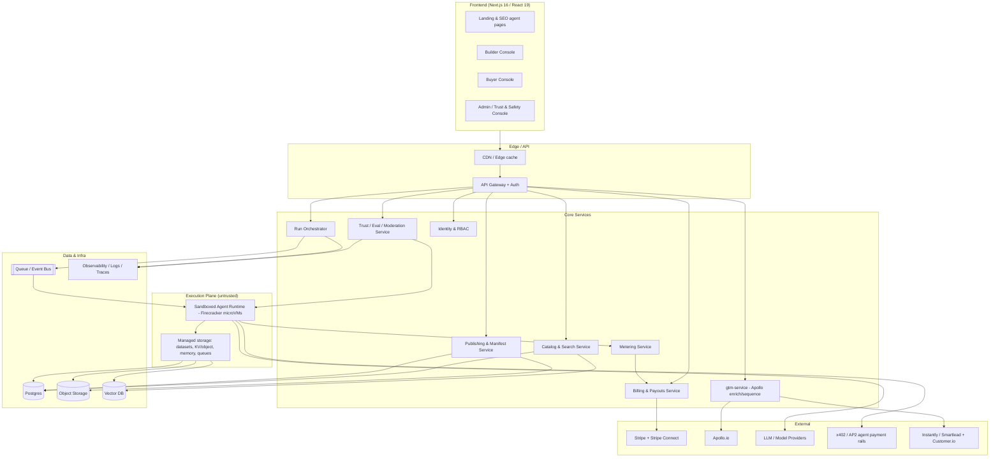

# Technical Architecture & Frontend Specification
## The Dude — Universal AI Agent Marketplace & Rental Platform

> **Version:** 1.0 (Draft) · **Date:** June 2026 · **Status:** For review
> **Note:** The frontend is an explicit product differentiator — see §7 for the detailed frontend spec.
> **Supporting evidence:** `../01-research/apify-deep-dive.md`, `apollo-integration-research.md`, `market-research.md`. Sandbox-isolation and frontend-stack recommendations below are validated against current (June 2026) primary sources cited inline.

---

## 1. Architecture Principles

1. **Agent-native, not scraping-retrofitted.** Unlike Apify (Actors = stateless input→output jobs), design first-class support for **stateful, multi-step, memory-using agents** with sessions, tool orchestration, and long-horizon tasks.
2. **Security first.** Untrusted third-party agent code runs in **hardware-isolated sandboxes**. Assume hostile code.
3. **Meter everything.** A single, agent-native usage-metering layer (compute + inference/tokens + tool calls + storage + custom events) is the universal billing currency — the core of the business model.
4. **Interoperable & open.** MCP-native and A2A-ready from day one; "bring any framework" (LangChain, CrewAI, AutoGen, OpenAI Agents SDK, custom).
5. **Frontend as differentiator.** Invest disproportionately in a world-class landing experience + powerful console.
6. **Capital-efficient.** Prefer managed building blocks (sandbox provider, billing infra, MoR) early; insource where margin/control demands it at scale (Apify did ~$25M ARR on ~$3M).

---

## 2. High-Level System Architecture

---

## 3. Sandboxed Agent Execution (the hardest problem)

### 3.1 Requirement
Run **untrusted, third-party agent code** at scale, multi-tenant, metered, with strong isolation, fast cold starts, network egress control, and support for stateful/long-running agents.

### 3.2 Options compared (2026)

| Approach | Isolation | Cold start | Notes |
|---|---|---|---|
| **Firecracker microVMs** (e.g., **E2B**, Bunnyshell/hopx) | Hardware (KVM, separate kernel) | ~100–200ms | **Gold standard** for untrusted code; powers AWS Lambda; multi-language; self-hostable (E2B experimental); granular egress controls; pause/resume state. |
| **gVisor** (e.g., **Modal**, Cloud Run) | Syscall interception (user-space kernel) | <1s warm / 2–5s cold | Stronger-than-container; great for **GPU/ML** workloads; managed-only (Modal). |
| **Kata Containers** | microVM via container runtime | ~1s | K8s-native microVM isolation; more ops overhead. |
| **Plain Docker** | Namespaces/cgroups (shared kernel) | ~instant | **Insufficient** for hostile code alone. |
| **WASM/WASI** | Capability-based | ~ms | Great for constrained tools; limited for arbitrary agent runtimes today. |

### 3.3 Recommendation (two-plane model)
- **Primary runtime: Firecracker microVMs via E2B** (managed initially; evaluate self-hosting for margin/control at scale). Rationale: purpose-built for agent code, hardware isolation, ~125–200ms cold start, multi-language, granular network egress (`allow/deny` lists), pause/resume for stateful agents.
- **GPU / heavy-inference agents: Modal (gVisor)** as a complementary plane where GPU-accelerated execution is needed.
- **Persistent / long-lived agents (optional): Daytona** (~27–90ms, snapshot/fork, AGPL self-host) for stateful sessions where fast fork/resume matters.
- See the research deep-dive (`../01-research/technical-architecture-research.md` §1) for the full comparison and threat-model rationale.
- **Egress control by default:** deny-all outbound, allow-list per agent manifest (LLM endpoints, declared APIs); prevents data exfiltration and SSRF.
- **Per-agent identity + secrets:** scoped secret injection, no shared credentials, audit every tool call.
- **Lifecycle:** create → inject input/secrets → run (sync/async/scheduled/standby) → meter → emit outputs + observability → tear down (or pause/resume for sessions).

> Apify runs Actors in Docker containers on K8s-like infra; for a *general untrusted AI agent* marketplace, microVM isolation is the safer baseline given the higher attack surface and the security/fraud risks documented in the market research (Visa: +25–40% malicious bot transactions).

### 3.4 Storage primitives (agent-native)
- **Datasets** (append-only structured results).
- **Key-value / object store** (blobs, files, run state).
- **Conversation / session memory** (first-class for stateful agents — a differentiator vs. Apify).
- **Task/request queues** (durable, resumable).
- Backed by Postgres + object storage + vector DB (for memory/retrieval).

---

## 4. Agent Runtime, Manifest & Interoperability

### 4.1 Agent manifest (the standard)
A declarative manifest packaged with each agent:
- Identity: name, slug, description, author, version, category.
- I/O: input/output JSON schemas.
- Runtime: container image (Dockerfile) or hosted code; resources (RAM/CPU/GPU); timeout; run mode (sync/async/scheduled/standby).
- Integrations: MCP tools exposed, A2A Agent Card, declared external endpoints (egress allow-list).
- Monetization: pricing model(s) + prices + billable events.
- Trust: eval suite reference, data-handling disclosures.

### 4.2 SDK (TS + Python)
- Lifecycle: `init`, read input, push output/data.
- **Billing hooks:** `charge({ event, count })` for pay-per-event (Apify-style `Actor.charge`).
- Storage: datasets, KV, memory, queues.
- Local run + test harness; eval runner.

### 4.3 Interoperability
- **MCP-native:** every agent can be exposed as an MCP tool; publish a platform MCP server exposing the catalog (Apify is early here — parity + better UX is achievable).
- **A2A-ready:** Agent Cards for agent-to-agent discovery; supports the agent-economy thesis.
- **Framework-agnostic:** LangChain, CrewAI, AutoGen, OpenAI Agents SDK, custom — all package via the manifest.

---

## 5. Metering, Billing & Payouts

### 5.1 Metering
- Capture per run: compute (RAM×time), inference/tokens, tool calls, storage/data transfer, and custom billable events.
- Attribute to (buyer, agent, run); stream events to the metering service → billing.

### 5.2 Billing
- **Pricing models:** pay-per-run, pay-per-event, **pay-per-outcome**, monthly rental/subscription, hybrid, free (builder's choice; can combine).
- **Usage-based billing engine:** own the metering events ourselves + a dedicated rating/invoicing layer. **Recommend Orb** (pricing simulation + real-time usage dashboards de-risk the take-rate model and the "surprise bill" problem). Note: **Stripe acquired Metronome (closed Jan 2026)**, so prefer Orb (or Lago for self-host) to avoid lock-in if not going Stripe-native.
- **Transparent, all-in pricing** to buyers + real-time cost display (avoid Apify's confusing layered costs and Lindy's credit backlash).

### 5.3 Payouts & revenue share
- **Stripe Connect** for marketplace payouts; automatic **monthly** payouts; low minimum threshold.
- **Revenue split:** generous, published formula; **0%-to-traction honeymoon → ~10–15% take rate** (Shopify/Atlassian/GitHub-inspired); **pay on all paid usage** (close Apify's free-user gap).
- **Merchant-of-Record:** use **Stripe Managed Payments** (GA in 2026, tax in 80+ countries) as native MoR — avoids a second vendor (e.g., Paddle). Cross-border + stablecoin payouts support international builders and a path to x402/AP2.
- **Infra margin** layered on metered usage (keeps headline split attractive while earning on every run).

### 5.4 Agent-payment rails (Phase 2/3)
- **x402** (HTTP 402 stablecoin micropayments) for A2A + metered rental; **AP2** (signed mandates) for delegated/authorized spend. Optional, not the default UX.

---

## 6. Backend Architecture

| Concern | Recommendation | Rationale |
|---|---|---|
| API | Typed API (tRPC/REST + OpenAPI), API gateway | DX + external API for programmatic/agent access |
| Orchestration | **Temporal** (durable workflows) + queue/event bus (SQS/Kafka/NATS) | Long-running, resumable agent runs; reliability |
| Primary DB | **PostgreSQL** (+ Drizzle ORM, type-safe) | Marketplace data, transactions |
| Object storage | S3-compatible | Artifacts, datasets, blobs |
| Vector DB | pgvector / dedicated vector store | Agent memory + semantic search |
| Search | Postgres FTS + semantic (vector) hybrid; consider Typesense/Meilisearch | Fast ranked discovery (< 300ms p95) |
| Auth (B2B) | **WorkOS / Clerk / Auth.js** | SSO/SAML for enterprise; fast for PLG |
| Observability | OpenTelemetry + logs/traces/metrics; per-run trace + tool-call inspection | Trust, debugging, drift detection |
| Multi-tenancy | Row-level + isolation in exec plane | Security + org management |
| `gtm-service` | Queue-backed Apollo wrapper (cache, credit budget, 429 backoff, polling fallback) | Onboarding + outbound (see Apollo research) |

### 6.1 Infra & DevOps
- **Cloud:** AWS or GCP (GCP if leaning on Cloud Run/gVisor; AWS for Firecracker/Lambda lineage).
- **IaC:** Terraform/Pulumi; **CI/CD:** GitHub Actions; **containers:** Kubernetes for control plane, microVM pool for execution plane.
- **Cost control:** autoscaling execution pool, volume-tiered infra pricing (CU-style discounts), aggressive teardown/pause of idle sandboxes.

---

## 7. Frontend Specification (CRITICAL DIFFERENTIATOR)

> Most agent marketplaces have weak UX. A stunning, fast, accessible frontend is a real wedge for a developer/business tool. Benchmarks to emulate: **Vercel, Linear, Stripe, Resend, Apify Console.**

### 7.1 Recommended stack (settled 2026 consensus)

| Layer | Choice | Why |
|---|---|---|
| Framework | **Next.js 16 (App Router) + React 19** | Dominant, SSR/SSG for SEO landing pages + RSC for fast console |
| Language | **TypeScript (strict)** | Safety at scale |
| Styling | **Tailwind CSS v4** (OKLCH tokens, P3) | Velocity + consistency; modern color space |
| Components | **shadcn/ui** (Radix primitives, you own the code) | Accessible, customizable, no version lock; the de facto SaaS layer |
| Data fetching | **TanStack Query v5** | Default async/server-state manager |
| Tables | **TanStack Table v8** | Data-heavy console views (runs, earnings, usage) |
| Forms | **React Hook Form + Zod** | Robust validated forms (publishing wizard, pricing) |
| Client state | **Zustand** (light) | Minimal global state |
| Animation | **Framer Motion** + `tw-animate-css` | Polished micro-interactions |
| Charts | **Recharts** (or Tremor for dashboards) | Earnings/usage analytics |
| Auth UI | WorkOS/Clerk components or Auth.js | B2B SSO + PLG |
| Testing | **Playwright + Vitest** | E2E + unit |
| Monorepo | **Turborepo** | Shared design system + apps |
| Hosting | **Vercel** (frontend) | Edge, preview deploys, performance |

### 7.2 Surfaces

**A. Landing & marketing (SEO-critical)**
- Stunning, fast hero + value props for both sides (builders & buyers).
- **Auto-generated agent listing pages** (`/agents/{slug}`): SSG/ISR, rich metadata, verified perf metrics, transparent pricing, reviews, demo, integrations — each an indexable, ranking page (product-led SEO engine).
- Category & comparison pages (programmatic SEO).
- Accessibility (WCAG AA), Core Web Vitals green, OG/structured data, AEO-friendly markup + `/.well-known/agents.md`.

**B. Builder console**
- Earnings & payouts, usage/run analytics, success rate, cost/profit trends, acquisition funnel (match/beat Apify transparency).
- Publishing wizard (manifest, code/container, pricing, mandatory sandbox test, eval results), version management, listing editor.
- Logs/debug with shareable run traces + tool-call inspection.

**C. Buyer console**
- Spend dashboard, active rentals/subscriptions, run history & outputs, saved/favorite agents, team management, billing.
- "Run a demo in 60 seconds," transparent real-time cost during runs.

**D. Admin / Trust & Safety console**
- Verification queue, moderation, dispute management, eval failures/drift alerts, marketplace-health dashboards.

### 7.3 Design system & quality bar
- Single design system (tokens in OKLCH, dark/light, density modes) shared across apps via Turborepo.
- Command palette, keyboard-first navigation (Linear-grade), optimistic UI, skeleton/loading states, empty states with guidance.
- Performance budget: fast TTFB (RSC/edge), no FOUC/hydration warnings, image optimization, route-level code splitting.

---

## 8. Security Architecture

- **Execution isolation:** Firecracker microVMs, deny-all egress + per-agent allow-list, scoped secrets, no cross-tenant access.
- **Identity:** per-agent + per-user identity; RBAC; org boundaries; SSO/SAML (enterprise).
- **Runtime policy engine:** authorize tool calls/spend (AP2-style mandates for delegated spend); fail-closed.
- **Audit:** immutable audit log of runs, tool calls, payments, admin actions.
- **Fraud/abuse:** anomaly detection on usage/billing, KYC for payouts, suppression lists, rate limiting.
- **Data:** encryption at rest/in transit, PII minimization, data-boundary controls for enterprise, retention/opt-out (esp. Apollo data).
- **Compliance:** EU AI Act-aware telemetry (identity, decoupled policy, auditable logs, drift detection); GDPR/CCPA.

---

## 9. Build vs. Buy (phased)

| Capability | Phase 0–1 | Phase 2–3 |
|---|---|---|
| Sandbox runtime | **Buy** (E2B managed; Modal for GPU) | Evaluate **self-host Firecracker** for margin/control |
| Usage billing | **Buy** (Stripe + Orb/Metronome/Lago) | Optimize/insource metering as volume grows |
| Payouts | **Buy** (Stripe Connect + MoR) | Same |
| Auth | **Buy** (WorkOS/Clerk) | Same + deeper enterprise SSO |
| Search | Postgres hybrid | Dedicated search (Typesense/Meili) + ML ranking |
| Outreach | **Buy** (Apollo + Customer.io + Instantly/Smartlead) | + Clay for GTM engineering |
| Frontend/design | **Build** (core differentiator) | Continuous investment |
| Trust/evals | Build light | Build full eval + drift platform (the moat) |

---

## 10. Phased Technical Roadmap

| Phase | Deliverables |
|---|---|
| **Phase 0 (0–3 mo)** | Manifest + SDK (TS/Python), E2B-based sandbox runtime, metering, Stripe Connect payouts, Postgres + storage primitives, auto-generated listing pages, basic hybrid search, builder/buyer consoles, `gtm-service` (Apollo enrich-on-signup). |
| **Phase 1 (3–6 mo)** | Public MVP in 2–3 categories, transparent pricing + real-time cost, reviews, light vetting, builder analytics, two onboarding funnels, observability/run traces. |
| **Phase 2 (6–12 mo)** | Verified badges + security review, automated evals + drift detection, anti-cold-start ranking, hybrid pricing, MCP server + A2A discovery, standby agents, deliverability layer, GPU plane (Modal). |
| **Phase 3 (12–18 mo)** | Enterprise: SSO/RBAC/audit, private marketplaces, data boundaries; x402/AP2 A2A payments; outcome-based billing at scale; self-host evaluation for sandbox/metering. |

---

## 11. Open Technical Questions

- Self-host Firecracker vs. stay on E2B — at what GMV does insourcing pay back?
- Exact usage-billing vendor (Orb vs. Metronome vs. Lago vs. Stripe-native) — depends on metering complexity.
- Ranking model for anti-cold-start discovery (heuristic → ML over time).
- MoR partner selection (tax coverage vs. fees).
- Memory/session architecture for long-horizon stateful agents (vector + state store design).

---

*Living document. A dedicated technical research deep-dive (extended vendor comparisons on sandboxing/billing/infra) can be generated as a follow-up; the core build-vs-buy decisions are captured above with inline source validation.*

---

## 12. Sources (validated June 2026)

**Sandboxed execution**
- AI Agent Sandboxing 2026 — Docker/E2B/Firecracker/gVisor/Modal/Daytona compared — <https://amux.io/guides/ai-agent-sandboxing/>
- Sandboxed environments for AI coding (microVM vs gVisor hierarchy) — <https://www.bunnyshell.com/guides/sandboxed-environments-ai-coding/>
- E2B vs Modal — code-execution sandboxes 2026 — <https://northflank.com/blog/e2b-vs-modal>

**Frontend stack**
- Next.js 16 + Tailwind v4 + shadcn/ui (2026) — <https://crea.mba/en/blog/nextjs-16-styling-guide-tailwind-v4-shadcn>
- Best React libraries & SaaS stack 2026 — <https://jsdev.space/react-stack-2026/>
- shadcn/ui + Next.js production guide 2026 — <https://stacknotice.com/blog/shadcn-ui-nextjs-complete-guide-2026>
- Next.js 16 + shadcn dashboard starter (TanStack Query/Table) — <https://github.com/Kiranism/next-shadcn-dashboard-starter>
